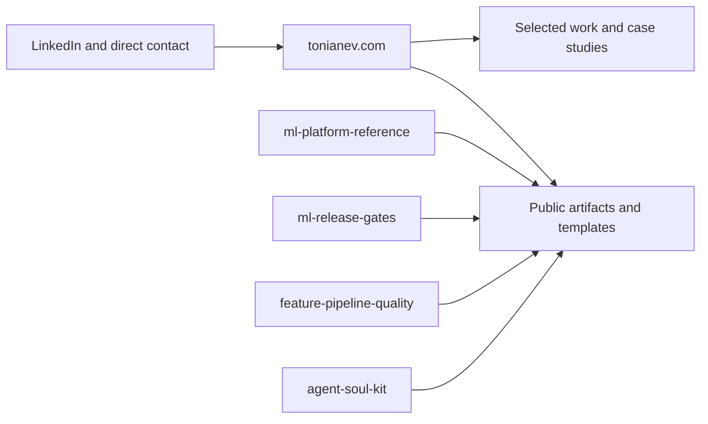

# Toni Anev

ML Platform Engineering Lead focused on AI infrastructure, MLOps, and production delivery systems.

I build the engineering layer that makes ML usable at scale: platform architecture, standards, pipelines, and the teams that operate them.

Most of my production work is private. Public summaries and selected work are available at [tonianev.com](https://tonianev.com).

## Public footprint map

## Current focus

- ML platform architecture for production-scale AI workloads
- MLOps standards, release workflows, and operational reliability
- Engineering systems that improve delivery speed and reproducibility
- Technical leadership for high-stakes ML programs

## Selected public work

- [Portfolio / case studies](https://tonianev.com)
- [ML Platform Reference](https://github.com/tonianev/ml-platform-reference)
- [ML Release Gates](https://github.com/tonianev/ml-release-gates)
- [Feature Pipeline Quality](https://github.com/tonianev/feature-pipeline-quality)
- [Agent Soul Kit](https://tonianev.com/agent-soul-kit.html)

## Selected outcomes (public summaries)

- Platform and infrastructure work supporting global AI/ML R&D workloads
- Reduced model productionization cycle time through platform and workflow improvements
- MLOps modernization for pricing and personalization systems
- Enterprise-scale ML/data systems for pricing, promotions, and segmentation

## Contact

- Website: [tonianev.com](https://tonianev.com)
- LinkedIn: [linkedin.com/in/tonianev](https://www.linkedin.com/in/tonianev/)
- Email: [tonianev@gmail.com](mailto:tonianev@gmail.com)

## What to look at first

1. [tonianev.com](https://tonianev.com) for the current public narrative.
2. [ml-platform-reference](https://github.com/tonianev/ml-platform-reference) for platform architecture and operating model patterns.
3. [ml-release-gates](https://github.com/tonianev/ml-release-gates) and [feature-pipeline-quality](https://github.com/tonianev/feature-pipeline-quality) for concrete CLI examples of enforceable ML delivery controls.
